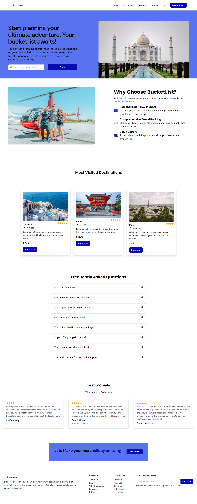
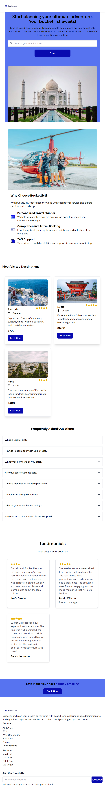
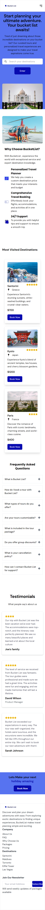

# Bucket List 

Project Name: Bucket List
This is the second task for programmify Pip3 internship


## Table of Contents

1. [Introduction](#introduction)
2. [Features](#features)
3. [Getting Started](#getting-started)
4. [User Guide](#user-guide)
5. [Installation](#installation)
6. [Technologies used](#technologies-used)
7. [Site Views](#site-views)
8. [Contributing](#contributing)
9. [Get In Touch](#get-in-touch)


### Introduction



Bucket is a responsive web application designed to help users explore and book exciting travel packages. The application is built using React and Tailwind CSS, and it integrates the Airbnb API to provide up-to-date travel information and features.

### Features

- Travel Packages: Browse a variety of travel packages with detailed information
- Search: Users can search for packages based on locations
- Booking System
- Responsive Design: The application is fully responsive and works well on all devices, from mobile phones to large desktop screens.
- API Integration: Utilizes the Airbnb API to fetch real time travel information, ensuring that users have access to the latest travel data.
- User Friendly Interface: A clean and intuitive interface that makes navigation and booking easy for users.

## Getting Started

To get started, simply click on the link [BudgetList](https://bucket-list-gray-eta.vercel.app/)


### User Guide

1. Browse destinations and tours by clicking on the search input, input location then click enter
2. Click on view details to view more information on a package
3. Book and manage tours

### Installation

1. Clone the repository

```bash
 git clone https://github.com/Ehmkayel/BucketList
```
2. Change directory

```bash
cd BucketList

```  
3. Run npm install to install dependencies

```bash
npm install

```

4. Create a .env file in the root directory and add your Airbnb API credentials from Rapid Api:

```bash
    VITE_APP_API_KEY=your_airbnb_api_key
```


5. Start the development server with npm run dev

```bash
npm run dev

```
6. Open your browser and navigate to 
```bash
http://localhost:3000 to view the application.
```

### Technologies Used

- Semantic Html
- React
- Tailwind CSS
- Api
- Mobile-first workflow
- TailwindCSS custom properties


### Contributing
If you'd like to contribute to this project, please follow these steps:

- Fork the repository. or git clone
- Create a new branch (git checkout -b feature-branch).
- Make your changes.
- Commit your changes (git commit -m 'Add new feature').
- Push to the branch (git push origin feature-branch).
- Create a pull request.

## Site Views






## Get in Touch

You can reach out to me;
 - Linkedin- [Morufat-Lamidi](https://linkedin.com/in/morufat-lamidi)
 - Frontend Mentor - [@Ehmkayel](https://www.frontendmentor.io/profile/Ehmkayel)
 - Twitter - [@kamalehmk](https://www.twitter.com/kamalehmk)
 - Gmail- [Mail](mailto:lamidimorufat0@gmail.com);


